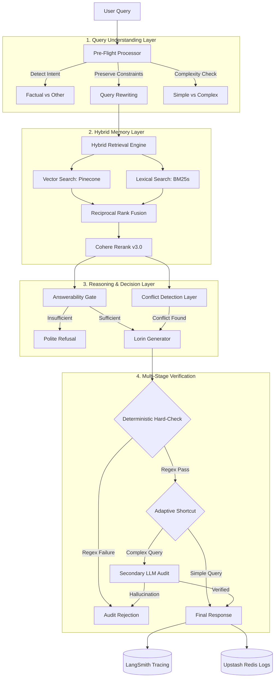

# 🧠 Lorin RAG Intelligence Suite: Architecture Pipeline

This document outlines the **Tier 2 Institution-Grade** RAG pipeline used by the MSAJCE Campus Buddy.

## 🏗️ The Decision Intelligence Flow

## 🛡️ Hardening Features

| Feature | Implementation | Purpose |
| :--- | :--- | :--- |
| **Deterministic Gate** | Regex-based value matching | Ensures numbers/times in the answer exist in the source text. |
| **Conflict Detector** | LLM Cross-referencing | Identifies if different sources provide contradictory information. |
| **Adaptive Pipeline** | Complexity short-circuiting | Reduces latency for simple lookups by skipping the secondary audit. |
| **Constraint Locking** | Pre-processor rewriting | Prevents the loss of critical modifiers (e.g., "morning", "temporary"). |
| **Source Attribution** | Forced `[Source X]` tags | Mandates that every factual claim is traceable to a specific chunk. |

## 🛠️ Tech Stack Highlights
- **Reasoning**: GPT-4o Mini
- **Embeddings**: text-embedding-3-small
- **Reranking**: Cohere English v3.0
- **Vector DB**: Pinecone Serverless
- **Lexical DB**: Local BM25s
- **Telemetry**: LangSmith
- **Cache**: Upstash Redis
